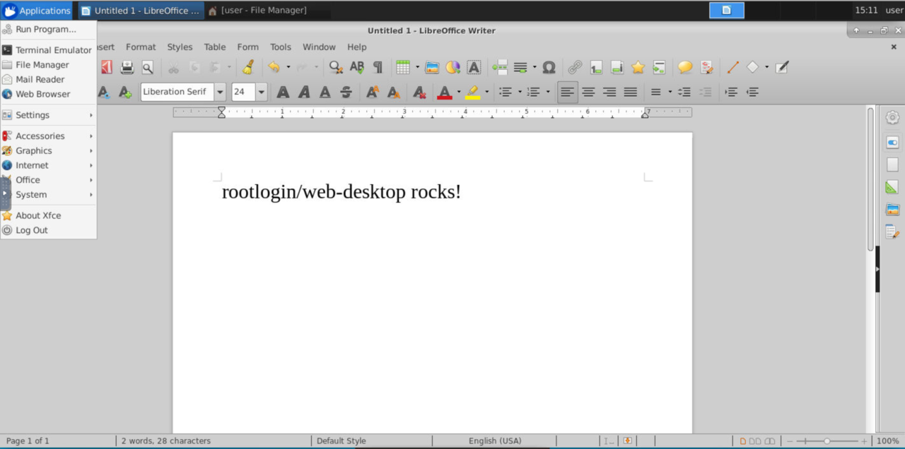

# Dockerized Xubuntu web desktop

[](https://microbadger.com/images/rootlogin/web-desktop "Get your own image badge on microbadger.com") [](https://microbadger.com/images/rootlogin/web-desktop "Get your own version badge on microbadger.com")  [](https://microbadger.com/images/rootlogin/web-desktop "Get your own commit badge on microbadger.com") [](https://quay.io/repository/rootlogin/web-desktop)



This image provides a dockerized web desktop based on Xubuntu 18.04 LTS (Xfce4). Thanks to noVNC you can access a full flegged linux desktop directly over your web browser.

## Features

 * Full flegged Xubuntu 18.04 desktop.
 * NoVNC with auto connect.
 * Password-less sudo.
 * OpenSSH client.

## Usage

To run this desktop enter:
```
docker run -p 80:8083 rootlogin/web-desktop
```

Then surf to [localhost](http://localhost) and have fun.

### Persistent user data

To persist user data you have to mount the volume /home/user:
```
docker run -p 80:8083 -v user_data:/home/user rootlogin/web-desktop
```

## Customizing

To customize your desktop create a child image, as example:

```
FROM rootlogin/web-desktop

RUN apt-get update \
  && DEBIAN_FRONTEND=noninteractive apt-get -y install \
  gimp \
  gimp-data \
  gimp-help-en
```

## Environment variables

You can use the following environment variables to customize your environment:

 * **TZ:** Timezone (Default: Europe/Zurich).
 * **LANG:** Locale (You have to enable the according locales first; Default: en_GB.UTF-8).
 * **DISABLE_SUDO:** Set to "true" to disable sudo (Default: false).

## Security notes

This image has no kind of encryption or authentication enabled. You should use a SSL frontend proxy with some kind of authentication (basic auth as example) like Nginx when you deploy this image in the public internet.

## FAQ

 * **Chromium browser does not work:** Yes because of the advanced sandboxing of Chromium which is not compatible with Docker. Try either to run this container privileged (`docker run --privileged rootlogin/web-desktop`) or start Chromium with disabled sandboxing (`chromium-browser --no-sandbox`).
 * **Error: "sudo: effective uid is not 0, is /usr/bin/sudo on a file system with the 'nosuid' option set or an NFS file system without root privileges?":** Check if you have activated the "--no-new-privileges" flag in docker. If you have activated this flag then sudo can't get higher rights.

## Contribution

This stuff is released under MIT license. I'm happy about every pull-request, that makes this thing better.
